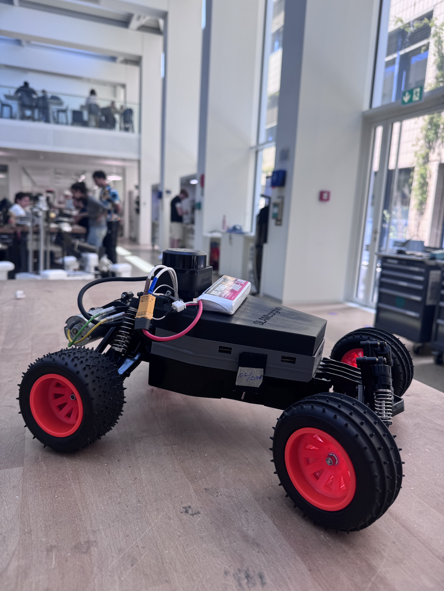
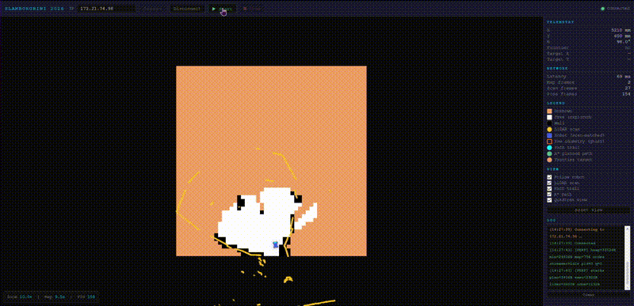
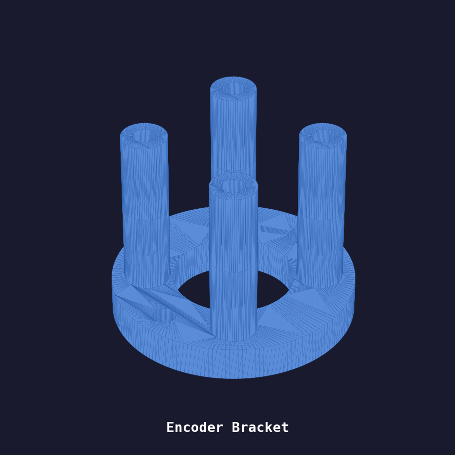
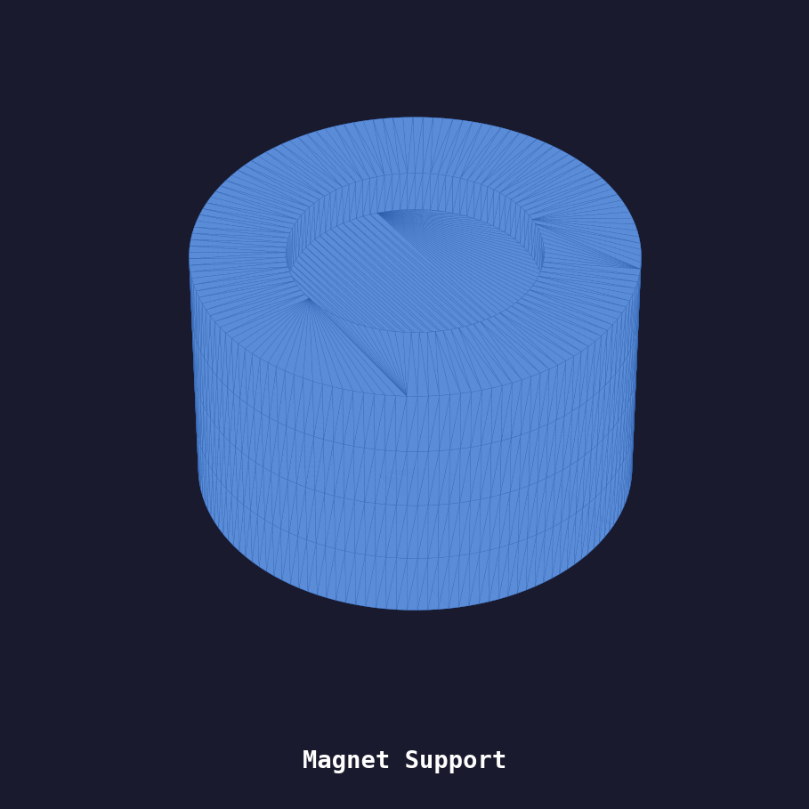
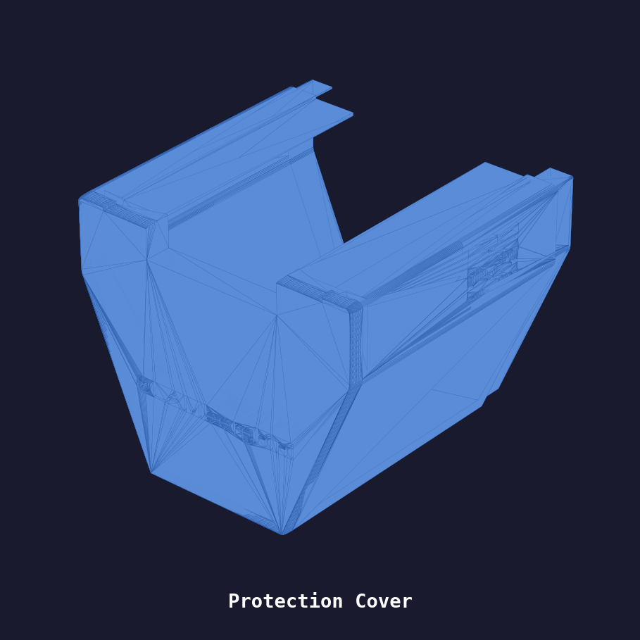
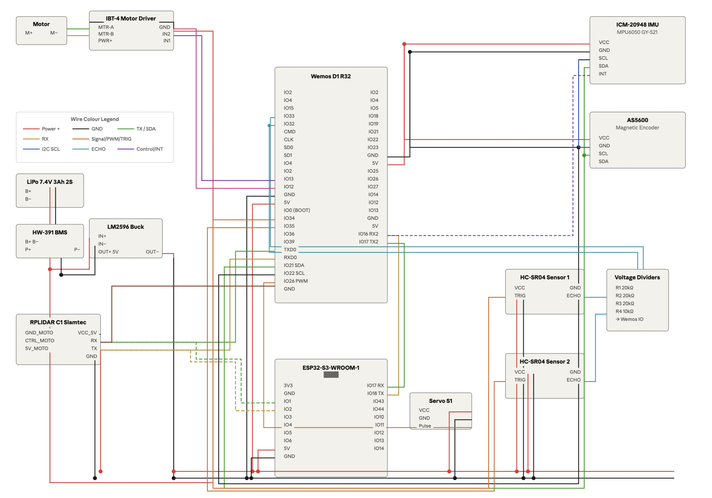
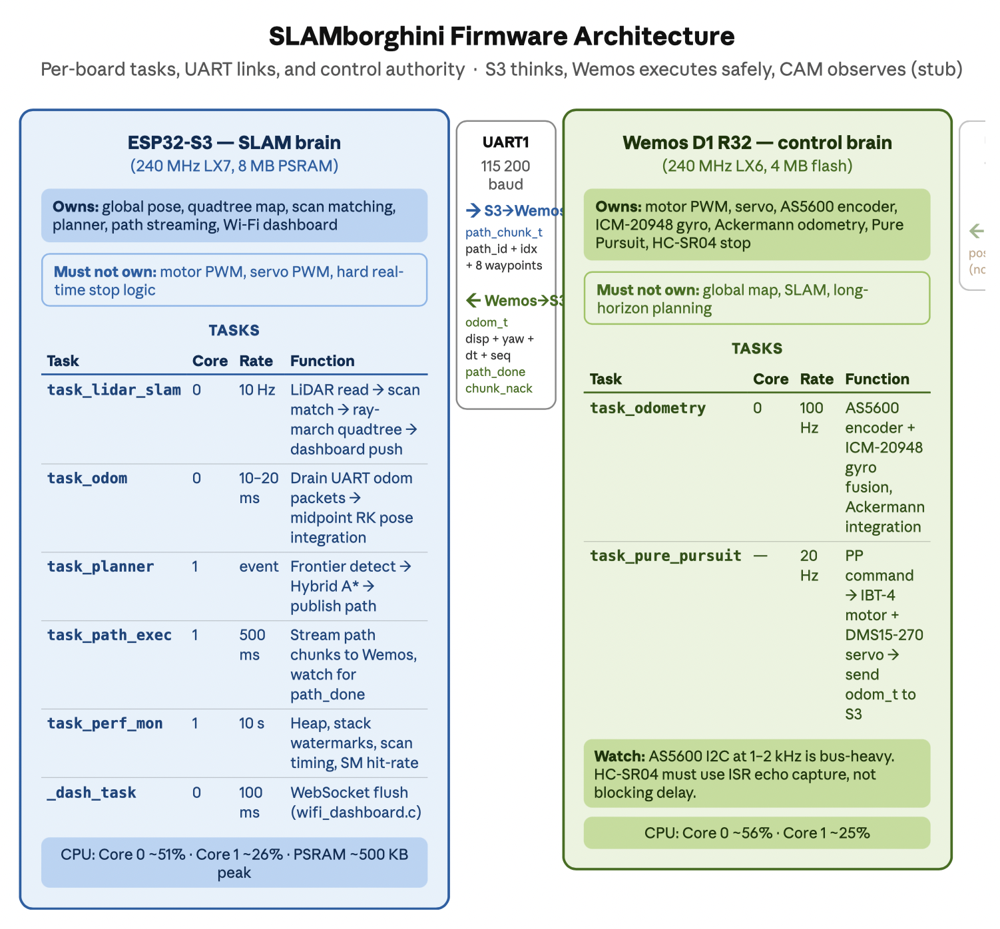

# SLAMborghini

> We built a SLAM car that explores rooms on its own, no laptop, no GPS, no internet. It sees the world through a spinning LiDAR, builds a live map as it drives, and figures out where to go next all by itself. Everything runs on two tiny ESP chips talking to each other in real time.

<p align="center">
  
</p>

**Course:** [Making Intelligent Things (CS-358)](https://edu.epfl.ch/coursebook/en/making-intelligent-things-a-CS-358-A) EPFL Spring 2026

**Team:** Sara Amoussi · Chahd Achkrou · Hala Dina Ben Khaddah · Yassine Elhachimi · Hana Hesham Anwar Hussein


---

## Project Context

**Overview**

SLAMborghini implements **Simultaneous Localization and Mapping (SLAM)** on a resource-constrained RC car platform. The system solves the classic SLAM issue, building a map while simultaneously tracking position within it, built around three core components:

1. **Mapping**: The map is a sparse quadtree, it recursively divides the arena into smaller and smaller cells, only allocating memory for regions the robot has actually observed. This makes it extremely memory-efficient on the microcontroller. The car continuously builds its map using data from the RPLiDAR. Each ray traces through space, marking cells it passes through as free and stamping the wall it hits as occupied. Evidence builds up over time, the more a wall gets confirmed, the more confident the map becomes. When memory starts running low, the system automatically clears out uncertain areas while keeping the walls it's already sure about, so the map stays reliable without running out of space.
2. **Localization**: The car always knows where it is, even when things get tricky. Between each LiDAR scan, odometry keeps track of its position, the wheel encoder measures how far it's moved and the IMU sensor tracks which way it's turned. But small errors add up over time, so every time a new scan comes in, a two-level correlative scan matcher compares what the LiDAR sees with what's already on the map and corrects any drift. If the scan matcher doesn't find a confident match, the system falls back to pure odometry rather than applying a bad correction, keeping the map stable even in featureless environments.
3. **Navigation**: The car decides where to go by looking at frontiers, the boundaries between areas it has already mapped and areas still unknown. A Wavefront Frontier Detection algorithm scans outward through free cells, clusters these boundaries together, and picks the closest significant one as the next target. Hybrid A* then plans a path to that target, respecting the car's Ackermann steering constraints so the path is actually drivable. The path is streamed in chunks over UART from the ESP32-S3 to the Wemos, where a Pure Pursuit controller executes it in real time by continuously steering toward a lookahead point on the path.

<p align="center">
  <b>🗺️ Live SLAM Mapping Demo</b>
</p>
<p align="center">
  
</p>

The key design decision is a **two-chip architecture**: the ESP32-S3 is the brain, it sees through the LiDAR, builds the map, figures out where to go, and sends path commands down to the Wemos over UART. The Wemos is the body, it owns the motors, the servo, and the sensors that measure motion, and it executes whatever the S3 tells it to drive. This clean split keeps the high-level thinking and the physical actuation fully independent, eliminating the timing conflicts that caused map drift when both were crammed onto one core.

Every bit of sensing, mapping, planning, and motor control happens on those two chips: no laptop, no cloud, no ROS. Just two microcontrollers talking to each other and figuring it out.

---

## Quick Jump To Detailed Documentation

For in-depth technical details, refer to the dedicated subsystem documentation:

<table>
<tr>
<td width="50%" align="center">

### 🧠 **[ESP32-S3: SLAM Brain](esp32s3/)**

LiDAR driver, quadtree map, correlative scan matching, RBPF, frontier detection, Hybrid A\*, Wi-Fi dashboard

</td>
<td width="50%" align="center">

### 🚗 **[Wemos D1 R32: Control Brain](wemos/)**

AS5600 encoder, ICM-20948 IMU, Ackermann odometry, Pure Pursuit controller, motor/servo control

</td>
</tr>
</table>

---

## Table of Contents

1. [Project Overview](#project-overview)
2. [Quick Start](#quick-start)
3. [Hardware](#hardware)
4. [System Architecture](#system-architecture)
5. [Software Setup](#software-setup)
6. [Configuration & Tuning](#configuration--tuning)
7. [Tools & Dashboard](#tools--dashboard)
8. [Known Issues & Limitations](#known-issues--limitations)
9. [Credits](#credits)

---

## Project Overview

### Vision

SLAMborghini is a fully autonomous RC car that you place in any unknown indoor space. It explores, builds a precise 2D floor plan in real time, and then navigates that space continuously, with no GPS signal, no connected laptop, and no cloud backend.

The full vision is laid out in the [Project Proposal](SLAMborghini-Proposal-1.pdf),  what's running today is Phase 1: full SLAM and autonomous patrol.

### How the Robot "Thinks"

The system runs a closed-loop pipeline, sense, plan, act, continuously and in real time, with responsibilities divided across two processors:

**High-Level Decision Making (ESP32-S3 SLAM Brain):**
1. **Perceive**: Read one 360° LiDAR scan (~100 ms per rotation)
2. **Correct**: Run correlative scan matching against the existing map to remove odometry drift
3. **Map**: Integrate the corrected scan into the sparse quadtree occupancy map
4. **Plan**: Detect exploration frontiers (free/unknown boundaries) → select nearest large frontier → run Hybrid A\* to compute a kinematically feasible path
5. **Command**:  Send the planned path to the Wemos over UART in small chunks of waypoints at a time, rather than all at once, so the Wemos always has the next steps ready without needing to buffer the entire route

**Low-Level Execution (Wemos D1 R32 Control Brain):**
1. **Localize**: Fuse AS5600 encoder distance with ICM-20948 gyro IMU heading at 100 Hz
2. **Track**: Follow the incoming path using Pure Pursuit; report consumed waypoints back
3. **Report**: Send odometry packets to the S3 at 20 Hz for pose integration

**Why this split?** SLAM and motor control have fundamentally different timing requirements. The S3 needs long uninterrupted windows to process LiDAR scans and update the map. The Wemos needs to fire motor commands at a tight, consistent rate to keep the car stable. When both tasks competed for the same processor, the motor interrupts would disturb the scan timing just enough to corrupt the map. Separating them onto dedicated chips eliminated that interference entirely.

### Technical Vocabulary

- **ESP32-S3**: Xtensa LX7 dual-core @ 240 MHz, 8 MB PSRAM, built-in Wi-Fi (SLAM Brain)
- **Wemos D1 R32**: ESP32 LX6 dual-core @ 240 MHz (Control Brain)
- **RPLiDAR C1**: 360° laser rangefinder, 12 m range, 10 Hz 
- **AS5600**: 12-bit I2C magnetic rotary encoder for wheel odometry
- **ICM-20948**: 9-DOF IMU; gyro Z only used (magnetometer disabled near motors)
- **IBT-4**: 50A MOSFET H-bridge motor driver
- **Quadtree**: Hierarchical spatial index; 4000 nodes × 12 B = 48 KB for a 10 m × 10 m map
- **Correlative scan matching**: Exhaustive 2-level grid search over (dx, dy, dθ), deterministic, ~5 ms
- **Hybrid A\***: Kinematically-constrained A\* that respects Ackermann steering limits
- **Pure Pursuit**: Geometric path-tracking controller for car-like robots
- **RBPF**: Rao-Blackwellized Particle Filter (module exists; currently pose integration uses direct complementary fusion)
- **UART bridge**: 115 200 baud serial link between S3 and Wemos; custom framed binary protocol

### Key Objectives 

- Real-time SLAM on a microcontroller with a full cycle time under 10 ms
- Sparse quadtree occupancy map of any unknown indoor room within 2 minutes of autonomous exploration
- Continuous autonomous frontier-based exploration and patrol along a Hybrid A\* route
- Stable differential odometry using the AS5600 magnetic encoder + ICM-20948 gyro fusion
- Live occupancy map streamed to a Wi-Fi dashboard accessible from any browser


---

## Quick Start

### Prerequisites Checklist

**Hardware:**
- Assembled SLAMborghini car (see [Hardware section](#hardware))
- 7.4 V LiPo battery (charged)
- USB-C to USB-C cable for flashing the ESP32-S3
- USB-C to Micro-USB cable for flashing the Wemos D1 R32
- Computer on the same Wi-Fi network as the car

**Software:**
- [PlatformIO Core](https://docs.platformio.org/en/latest/core/index.html) or VS Code extension

### Flash & Run

**Step 1: Clone the Repository**
```bash
git clone https://github.com/epfl-cs358/2026sp-SLAMborghini.git
cd 2026sp-SLAMborghini
```

**Step 2: Set Wi-Fi Credentials**

Edit [esp32s3/main.c](esp32s3/main.c) lines 74–75 before flashing:
```c
#define WIFI_SSID      
#define WIFI_PASSWORD  
```

**Step 3: Flash the ESP32-S3 (SLAM Brain)**
```bash
# In VS Code with PlatformIO:
# 1. Connect ESP32-S3 via USB
# 2. Open PlatformIO extension (alien icon)
# 3. Go on the terminal, type: cd esp32s3, and then type: pio run -e esp32s3 -t upload 
```

**Step 4: Flash the Wemos D1 R32 (Control Brain)**
```bash
# 1. Connect Wemos via USB
# 2. Click wemos → General → Upload, cd wemos, and then type: pio run -e wemos_slam -t upload 
```

**Step 5: Power Up**
1. Connect the 7.4 V LiPo battery
2. Open a browser and navigate to the IP address printed on the ESP32-S3 serial monitor
3. Open `tools/dashboard/live_dashboard.html`, enter the ESP32-S3 IP address
4. Click **Start** to begin autonomous exploration

**What to expect:**
- Live dashboard shows the occupancy map building in real time
- Robot explores frontiers and navigates toward them autonomously

---

## Hardware

### Component List

| # | Component | Model / Spec | Qty | Status |
|---|-----------|--------------|-----|--------|
| 1 | ESP32-S3 dev board | ESP32-S3-WROOM-1, 8 MB PSRAM | 1 | Order |
| 2 | Magnetic encoder + magnet | AS5600 + 6 mm magnet | 1 | Order |
| 3 | RPLiDAR C1 | Slamtec, 12 m, 10 Hz | 1 | Existing |
| 4 | ICM-20948 IMU | 9-DOF, magnetometer disabled | 1 | Existing |
| 5 | Wemos D1 R32 | ESP32 LX6, 4 MB flash | 1 | Existing |
| 6 | ESP32-CAM AIThinker | OV2640 2 MP | 1 | Existing (stub only) |
| 7 | IBT-4 motor driver | 50A MOSFET H-bridge | 1 | Existing |
| 8 | DMS15-270 servo | 15 kg·cm, 270° range | 1 | Existing |
| 9 | LM2596 buck converter | 7.4 V → 5 V, 3 A | 1 | Existing |
| 10 | LiPo battery 7.4 V 3000 mAh 2S | RedPower + HW-391 BMS | 1 | Existing |
| 11 | Active buzzer 5 V | 85 dB piezo | 1 | Stock |
| 12 | Electrolytic cap 1000 µF 16V | Motor/logic rail decoupling | 2 | Stock |
| 13 | 1N4007 diode | Flyback protection | 4 | Stock |
| 14 | 4.7 kΩ resistor | I2C pull-ups (6 total) | 6 | Stock |


### 3D Printed Parts

All custom mechanical parts were designed in CAD and printed in PLA. Source files (`.step` for editing, `.stl` for slicing) are in [`docs/diagrams/hardware/CAD/`](docs/diagrams/hardware/CAD/).

<table>
<tr>
<td width="50%" align="center">

**Encoder Bracket**



Mounts the AS5600 encoder at the rear wheel<br>
[📄 STL](docs/diagrams/hardware/CAD/Encoder_Bracket.stl) · [📐 STEP](docs/diagrams/hardware/CAD/Encoder_Bracket_v1.step)

</td>
<td width="50%" align="center">

**Magnet Support**



Holds the 6 mm magnet centred on the wheel axle<br>
[📄 STL](docs/diagrams/hardware/CAD/Magnet_Support.stl)

</td>
</tr>
<tr>
<td width="50%" align="center">

**Protection Cover**



Shield over the electronics bay<br>
[📄 STL](docs/diagrams/hardware/CAD/Protection_Cover.stl) · [📐 STEP](docs/diagrams/hardware/CAD/Protection_Cover.step)

</td>
<td width="50%" align="center">

**Electronics Tray**


Chassis-mounted tray for all PCBs and modules<br>
[📄 STL](docs/diagrams/hardware/CAD/electronics_tray.stl) · [📐 STEP](docs/diagrams/hardware/CAD/electronics_tray.step)

</td>
</tr>
</table>

> **Recommended print settings:** PLA, 0.2 mm layer height, 20% infill, 3 perimeters. The Encoder Bracket and Magnet Support are precision-fit parts, print at 100% scale with no scaling.

### Pin Assignment Summary



**ESP32-S3:**

| GPIO | Function | Connected to |
|------|----------|--------------|
| GPIO14 (RX) | UART1 LiDAR | RPLiDAR C1 TX |
| GPIO13 (TX) | UART1 LiDAR | RPLiDAR C1 RX |
| GPIO17 (TX) | UART2 Bridge → Wemos | Wemos GPIO16 |
| GPIO16 (RX) | UART2 Bridge ← Wemos | Wemos GPIO17 |

**Wemos D1 R32:**

| GPIO | Function | Connected to |
|------|----------|--------------|
| GPIO21 | I2C SDA | AS5600 + ICM-20948 |
| GPIO22 | I2C SCL | AS5600 + ICM-20948 |
| GPIO16 (RX) | UART2 Bridge | ESP32-S3 GPIO17 |
| GPIO17 (TX) | UART2 Bridge | ESP32-S3 GPIO16 |
| GPIO19 | IBT-4 RPWM (forward) | IBT-4 IN1 |
| GPIO13 | IBT-4 LPWM (backward) | IBT-4 IN2 |
| GPIO2 | Servo PWM | DMS15-270 |
| GPIO14/27 | HC-SR04 A TRIG/ECHO | Front-left sonar |
| GPIO25/26 | HC-SR04 B TRIG/ECHO | Front-right sonar |


### Power Architecture

The system runs from a single 7.4 V LiPo with a dual-rail split:

| Rail | Voltage | Source | Powers |
|------|---------|--------|--------|
| Motor rail | 7.4 V direct | LiPo → HW-391 BMS → IBT-4 | IBT-4 only |
| Logic rail | 5 V regulated | LiPo → HW-391 BMS → LM2596 | All ESP32 boards, RPLiDAR, HC-SR04, servo |
| 3.3 V sub-rail | 3.3 V | Onboard ESP32 regulators | ICM-20948, AS5600 |

Motor GND and logic GND are separated physically; one controlled common reference point near power entry.

---

## System Architecture

Computation is split across two ESP32s with clearly defined roles:

- **ESP32-S3**: SLAM pipeline, frontier exploration, global planning, Wi-Fi dashboard
- **Wemos D1 R32**: Sensor fusion, Pure Pursuit execution, motor/servo control



Both run **FreeRTOS** for priority-based real-time scheduling. The S3 connects to the existing Wi-Fi network and serves a live HTTP + WebSocket dashboard.

```
────────────────────────────────────────────────────────────────────────
  ESP32-S3  SLAM Brain  (10 Hz SLAM loop)
  • LiDAR driver + correlative scan matching
  • Sparse quadtree occupancy map (48 KB, 4000 nodes, 10 m × 10 m)
  • RBPF 20-particle pose estimator
  • Wavefront Frontier Detection + Hybrid A* planner
  • Frontier blacklisting, path streaming to Wemos
  • Wi-Fi HTTP + WebSocket dashboard (live map, pose, path overlay)
────────────────────────────────────────────────────────────────────────
                     UART  115 200 baud
  odom_t packets ←   (linear_disp_mm, yaw_rate_imu, dt_ms, seq)
  path_chunk_t  →    (path_id, start_index, 8 waypoints per chunk)
  path_done     ←    (signal: path complete, please replan)
  chunk_nack    ←    (signal: out-of-order chunk, resend from index N)
────────────────────────────────────────────────────────────────────────
  Wemos D1 R32  Control Brain  (20–100 Hz control loops)
  • AS5600 encoder + ICM-20948 gyro fusion at 100 Hz
  • Ackermann odometry model
  • Pure Pursuit path tracking (20 Hz, 32-waypoint ring buffer)
  • IBT-4 motor PWM + DMS15-270 servo control

────────────────────────────────────────────────────────────────────────
```

### ESP32-S3 Tasks

| Task | Core | Priority | Period | Function |
|------|------|----------|--------|----------|
| `task_lidar_slam` | 0 | 7 | ~100 ms | LiDAR read → scan match → ray-march → dashboard push |
| `task_odom` | 0 | 6 | 10 ms | Drain UART odom packets → midpoint RK pose integration |
| `task_planner` | 1 | 3 | event-driven | Frontier detect → Hybrid A\* → publish path to exec |
| `task_path_exec` | 1 | 3 | 500 ms | Stream path chunks to Wemos, watch for path_done |
| `task_perf_mon` | 1 | 1 | 10 s | Heap, stack watermarks, scan timing, SM hit-rate |
| `_dash_task` | 0 | 1 | 100 ms | WebSocket flush (inside wifi_dashboard.c) |

### Wemos D1 R32 Tasks

| Task | Core | Priority | Period | Function |
|------|------|----------|--------|----------|
| `task_odometry` | — | 5 | 10 ms (100 Hz) | AS5600 read + IMU fusion + Ackermann integration |
| `task_pure_pursuit` | — | 4 | 50 ms (20 Hz) | PP command → motor/servo → send odom_t to S3 |

### SLAM Pipeline (one cycle)

```
LiDAR scan (~100 ms blocking read)
    │
    ▼
Snapshot raw odometry pose
    │
    ▼
Correlative scan matching (~5 ms)
  • Coarse: ±100 mm / 50 mm,  ±8° / 4°  → 125 candidates
  • Fine:   ±20 mm / 10 mm,   ±2° / 1°  → 125 candidates
  • Rejection: hit-rate < 10%  OR  |Δ| > 80 mm / 12°
    │
    ▼
Apply correction to running pose estimate
    │
    ▼
Ray-march scan into quadtree map (Bresenham per beam)
  • HIT +30, MISS −2  (15:1 ratio — walls resist free-space erosion)
  • Auto-compact at 85% pool usage: snapshot walls ≥ 10, wipe, re-insert
    │
    ▼
Frontier detection + A* (on planner task, 500 ms replan budget)
    │
    ▼
Stream path chunks to Wemos (8 waypoints/chunk, NACK-retry protocol)
```

### Communication Protocol (UART Bridge)

| Direction | Message | Size | Rate |
|-----------|---------|------|------|
| Wemos → S3 | `odom_t` (linear_disp + yaw_rate + dt + seq + consumed_wp) | 20 B | 20 Hz |
| S3 → Wemos | `path_chunk_t` (path_id + start_index + 8 waypoints) | 136 B | on replan |
| Wemos → S3 | `path_done` marker | 4 B | on path complete |
| Wemos → S3 | `chunk_nack` (path_id + expected_index) | 4 B | on out-of-order |

The path streamer on the S3 maintains a sliding window of the planned path and proactively tops up the Wemos ring buffer as consumed waypoints are reported.

---

## Software Setup

### Project Structure

```
2026sp-SLAMborghini/
├── esp32s3/                   # SLAM Brain firmware
│   ├── main.c                 # Tasks: lidar_slam, odom, planner, path_exec, perf_mon
│   └── src/
│       ├── lidar_driver.c/h   # RPLiDAR C1 UART driver
│       ├── lidar_to_map.c/h   # Bresenham ray-march into quadtree
│       ├── quadtree_map.c/h   # Sparse quadtree occupancy map
│       ├── scan_matcher.c/h   # Two-level correlative scan matching
│       ├── rbpf.c/h           # Rao-Blackwellized Particle Filter
│       ├── frontier_detector.c/h  # Wavefront Frontier Detection (WFD)
│       ├── hybrid_astar.c/h   # Hybrid A* path planner
│       ├── path_streamer.c/h  # Chunked path streaming + NACK retry
│       ├── uart_bridge.c/h    # Framed binary UART protocol
│       └── wifi_dashboard.c/h # HTTP + WebSocket live dashboard
│
├── wemos/                     # Control Brain firmware
│   ├── main.c                 # Tasks: task_odometry, task_pure_pursuit
│   ├── imu_gyro.c/h           # ICM-20948 gyro-Z driver
│   └── src/
│       ├── task_odometry.c/h  # 100 Hz sensor fusion task
│       ├── imu_encoder_driver.c/h  # AS5600 encoder + IMU read
│       ├── encoder_ackermann_odometry.c/h  # Ackermann kinematic model
│       ├── pure_pursuit_controller.c/h  # Pure Pursuit + ring buffer
│       └── uart_bridge.c/h    # Framed binary UART protocol (Wemos side)
│
├── esp32cam/                  # Vision Brain (stub — not functional)
│   └── main.c                 # posture_classifier_init() only; loop commented out
│
├── tools/
│   ├── dashboard/
│   │   ├── live_dashboard.html       # Main browser UI (WebSocket map + pose)
│   │   ├── frontier_dashboard.html   # Frontier overlay debug view
│   │   └── playback_dashboard.html   # Replay from room.log
│   ├── parse_room/
│   │   └── parse_room.py             # Convert room.log to map image
│   └── slam_sim.py                   # SLAM simulator (desktop testing)
│
├── hardware_pins.h            # All GPIO assignments (edit here to rewire)
├── types.h                    # Shared data structures (both boards)
└── profiler/                  # FreeRTOS CPU profiling helper
```

### Development Environment

**Prerequisites:**
- [PlatformIO Core](https://docs.platformio.org/en/latest/core/index.html) or VS Code extension
- ESP-IDF v5.x (bundled by PlatformIO, no separate install needed)

### Flash ESP32-S3

```bash
cd esp32s3
# Via PlatformIO CLI:
pio run -e esp32s3 -t upload
pio device monitor
```

### Flash Wemos D1 R32

```bash
cd wemos
pio run -e wemos_slam -t upload 
pio device monitor
```

### Wi-Fi Configuration

Edit [esp32s3/main.c](esp32s3/main.c) before flashing:
```c
#define WIFI_SSID      "your_network"
#define WIFI_PASSWORD  "your_password"
```

The ESP32-S3 connects to your existing Wi-Fi (station mode, not AP). The IP address is printed on the serial monitor at boot.

---

## Configuration & Tuning

### Map Parameters

```c
// esp32s3/main.c — app_main()
quadtree_map_init(&s_map, 10000.0f, 10000.0f, 156.0f);
//                         ^width mm  ^height mm  ^leaf cell mm
```

10 m × 10 m arena with 156 mm leaf resolution (10 000 / 64, depth 7).

```c
// esp32s3/src/quadtree_map.h
#define QT_POOL_SIZE  4000   // 4000 × 12 B = 48 KB
#define QT_MAX_DEPTH  7
#define QT_HIT_INC    30     // log-odds increment on obstacle hit
#define QT_MISS_DEC  (-2)    // log-odds decrement per free-ray pass
```

**Trade-offs:**
- Larger `QT_POOL_SIZE` → more map detail → more RAM (must fit in D-cache for scan matching)
- Higher `QT_HIT_INC` / lower `QT_MISS_DEC` ratio → walls persist longer → less flicker, slower erasure

### Scan Matcher Parameters

```c
// esp32s3/src/scan_matcher.c
// Coarse: ±100 mm / 50 mm step,  ±8° / 4° step  → 125 candidates
// Fine:   ±20 mm  / 10 mm step,  ±2° / 1° step  → 125 centred on coarse best
// Rejection thresholds:
//   hit-rate < 10%            → map too sparse
//   improvement < 5 beams     → no real gain
//   |dx| or |dy| > 80 mm     → implausibly large jump
//   |dθ| > 12°                → implausibly large rotation
```

### Pure Pursuit Parameters

```c
// wemos/src/pure_pursuit_controller.c — pp_init()
pp->wheelbase_mm      = 260.0f;    // front-to-rear axle distance
pp->lookahead_mm      = 350.0f;    // look-ahead distance
pp->fixed_speed_mm_s  = 150.0f;    // constant forward speed
pp->goal_tolerance_mm = 120.0f;    // waypoint considered reached
```

**Tuning guide:**
- `lookahead_mm` too small → oscillation at corners
- `lookahead_mm` too large → cuts corners, overshoots frontiers
- `fixed_speed_mm_s` higher → faster exploration, worse scan quality (motion blur)

### Servo Calibration

```c
// wemos/main.c
#define SERVO_DUTY_CENTER  4700u    // measured true straight
#define SERVO_DUTY_LEFT    3500u    // ~65° left
#define SERVO_DUTY_RIGHT   5900u    // ~65° right
#define SERVO_STEER_GAIN   1042.0f  // LEDC counts per radian
```

### FreeRTOS Task Priorities

```c
// ESP32-S3
task_lidar_slam : Core 0, Priority 7, Stack 6 KB
task_odom       : Core 0, Priority 6, Stack 3 KB
task_planner    : Core 1, Priority 3, Stack 6 KB
task_path_exec  : Core 1, Priority 3, Stack 5 KB
task_perf_mon   : Core 1, Priority 1, Stack 3 KB
_dash_task      : Core 0, Priority 1, Stack 4 KB  (inside wifi_dashboard.c)

// Wemos D1 R32
task_odometry     : Priority 5, Stack 4 KB
task_pure_pursuit : Priority 4, Stack 4 KB
```

---

## Tools & Dashboard

### Live Dashboard

Open [tools/dashboard/live_dashboard.html](tools/dashboard/live_dashboard.html) in any browser. Enter the ESP32-S3 IP address and connect.

**Dashboard features:**
- Real-time occupancy map (quadtree cells rendered as coloured pixels)
- Robot pose marker (blue car icon) and raw odometry ghost (orange, pre-scan-match)
- Planned A\* path overlay (waypoint polyline)
- Active frontier target marker
- Live LiDAR scan overlay (polar fan)
- Log panel showing `[PLAN]`, `[SM]`, `[PERF]` messages
- **Start / Stop** buttons to gate autonomous exploration


---

## Known Issues & Limitations

| Issue | Status | Notes |
|-------|--------|-------|
| Static environment assumed | Active | Dynamic obstacles (people) are not filtered from the map |
| ESP32-CAM not functional | Not started | Camera init runs; posture classifier loop is commented out |
| Human detection / Phase 2 | Not started | S3KM1110 mmWave not wired; no alert pipeline |
| No loop closure | Not started | Map fingerprinting module described in proposal; not implemented |

---

## Credits

### Project Team

SLAMborghini was developed as part of the [Making Intelligent Things (CS-358)](https://edu.epfl.ch/coursebook/en/making-intelligent-things-a-CS-358-A) course at **EPFL** (École Polytechnique Fédérale de Lausanne), Spring 2026.

**Team:** Sara Amoussi · Chahd Achkrou · Hala Dina Ben Khaddah · Yassine Elhachimi · Hana Hesham Anwar Hussein

### Key Technologies & References

- **FreeRTOS** — Real-time operating system for multitasking on ESP32
- **ESP-IDF** — Espressif IoT Development Framework
- **RPLiDAR C1 SDK** — Slamtec LiDAR interface
- **PlatformIO** — Development platform and build system for ESP32
- Correlative scan matching: [Olson 2009, "Real-time correlative scan matching"](https://april.eecs.umich.edu/papers/details.xml?name=olson2009icra)
- Hybrid A\*: [Dolgov et al., "Practical Search Techniques in Path Planning for Autonomous Driving"](https://ai.stanford.edu/~ddolgov/papers/dolgov_gpp_stair08.pdf)
- Pure Pursuit: [Coulter 1992, "Implementation of the Pure Pursuit Path Tracking Algorithm"](https://www.ri.cmu.edu/pub_files/pub3/coulter_r_craig_1992_1/coulter_r_craig_1992_1.pdf)

### Use of AI Tools in Development

This project was developed with assistance from AI-powered development tools in accordance with EPFL academic integrity guidelines.


**AI did NOT:** define project goals, make architectural decisions, perform hardware assembly or wiring, collect experimental data, or validate performance on the physical car.


---

**Questions or issues?** Open a GitHub issue on the [project repository](https://github.com/epfl-cs358/2026sp-SLAMborghini). For any further questions or feedback, contact: hana.hussein@epfl.ch chahd.achkrou@epfl.ch sara.amoussi@epfl.ch hala.benkhaddah@epfl.ch yassine.elhachimi@epfl.ch
